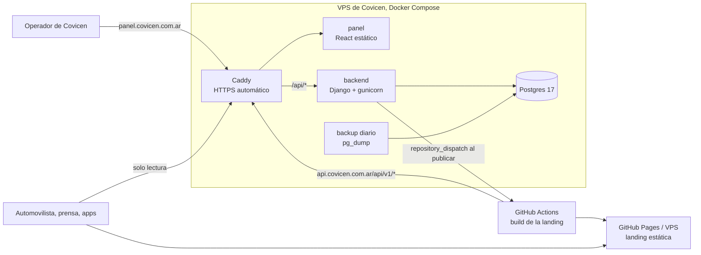

# Tarifario y catálogo del tramo — diseño (spec)

- **Fecha:** 2026-09-05
- **Estado:** aprobado en brainstorming con Juli; pendiente de revisión del documento escrito.
- **Contexto:** `obsidian/Home.md` → [[Sistemas de Covicen]] (mapa objetivo, roadmap, decisiones cerradas y por qué), [[Costura de datos]] (cómo la landing lee datos), [[Sistema de diseno del panel]] (cómo se ve el backoffice). Este spec no repite eso; lo referencia.
- **Alcance:** el **primer sistema de Covicen**. Vive en un repo privado aparte (`covicen-sistemas`); este documento queda en el repo público de la landing porque la landing es su consumidor y porque las decisiones de Covicen se documentan acá.

## 1. Qué se construye y para qué

Un sistema con el que **alguien de Covicen, sin devs, carga y publica el cuadro tarifario de peaje y el catálogo del tramo (rutas, ciudades del mapa, cabinas)**, y la landing pública los muestra en minutos. Reemplaza el archivo JSON versionado que hoy alimenta la landing, y evita el modelo de la referencia (tarifas cargadas por SQL a mano en la base de cabinas y publicadas en la web como imágenes).

Tres piezas, un solo proyecto:

1. **Backend Django** (modelos, reglas de negocio, dos APIs, publicación hacia la web).
2. **Panel del operador en React** (login, catálogo, categorías, cuadros, publicaciones, usuarios), con el tema "Papel con marco de tinta" adaptado a la marca.
3. **Cambios en la landing** para leer tramo y tarifario de la API cuando exista el servidor, y reconstruirse sola al publicar.

Quién lo usa:

| Rol | Qué hace | Dónde |
|---|---|---|
| **Carga** (operador de Covicen) | Edita catálogo y borradores de cuadros; manda a revisión | Panel |
| **Publicación** (responsable) | Revisa y publica; archiva; reintenta el aviso a la web | Panel |
| **Administración** (Juli al principio) | Todo lo anterior más usuarios y roles | Panel |
| Automovilista, prensa, apps de terceros | Leen el tarifario vigente y el catálogo | Landing y API pública |

Las cinco mejoras que definen "hiper mejorado" respecto de la referencia están en [[Sistemas de Covicen]]; acá se traducen a reglas concretas (§5).

## 2. Decisiones cerradas

Las decisiones de brainstorming (identidad, panel en React, cómo consume la landing, dueño del contrato, repo privado, VPS por Covicen, infraestructura, CI como compuerta, seguridad, horizonte de subdominios) están en [[Sistemas de Covicen]] con su porqué. Decisiones **de diseño** tomadas al escribir este documento:

| Tema | Decisión | Por qué |
|---|---|---|
| Regla de vigencias | Se garantiza a nivel **cuadro**: dos cuadros publicados no pueden solaparse en fechas, con una restricción de exclusión en Postgres. | Cada cuadro trae todas las categorías; con eso "misma cabina y categoría el mismo día" queda cubierto sin una restricción por fila. |
| Un cuadro publicado no se edita | Para corregir: duplicar, editar el duplicado, publicarlo. Si la fecha es la misma, primero se archiva el anterior. | Lo publicado es lo que vio el público; el historial tiene que ser una línea recta. |
| Cierre del cuadro anterior | Al publicar uno nuevo, el sistema pone `vigencia_hasta` al anterior en el día previo al `vigencia_desde` del nuevo, dentro de la misma transacción. | El operador no calcula fechas; la base impide errores. |
| Cuadros a futuro | Se publican con `vigencia_desde` futura. La API devuelve el vigente hoy y agrega un aviso con la fecha del próximo. La landing se reconstruye también una vez por día. | Mejora 3 sin cambiar el contrato ni la UI de la landing. |
| Excepción por cabina | `Tarifa.cabina` nulo = rige para todas las cabinas; una fila con cabina la reemplaza para esa cabina y categoría. | El contrato de la landing es un tarifario único del tramo; la API por cabina existe para terceros y para cuando el cuadro lo exija. |
| IVA y redondeo | Se carga `monto_sin_iva`. El sistema calcula `monto_con_iva` = redondeo half-up de `monto × (1 + alícuota)` al peso (por defecto) o al centavo, según el cuadro. Ambos se publican. | Mejora 4. 1.399 × 1,21 = 1.692,79 → 1.693, que es lo que publicó la prensa. |
| Aviso a la web | `repository_dispatch` a GitHub con un token de alcance mínimo; el resultado queda registrado en `Publicacion` con botón de reintento. Sin cola ni Celery. | Un POST corto y síncrono alcanza; una cola es infraestructura que nadie va a mantener. |
| Panel servido como un solo origen | Caddy sirve el panel estático y proxea `/api/*` al backend bajo el mismo host. Sesión por cookie `HttpOnly`, CSRF por cookie + header. Sin tokens en el navegador. | Misma regla que V-Shop; sin CORS para el panel. |
| Sin admin de Django | `django.contrib.admin` no se instala. | Decisión de Juli: todo por el panel React. |
| Panel: React 18, Tailwind 3.4, TypeScript 5.9, Vite 8, react-router 7, TanStack Query 5, Vitest 5 (verificado en npm el 2026-09-06) | React 18 y Tailwind 3 son los de V-Shop; el resto va en su versión actual. | Las primitivas, el shell y los guards se copian tal cual; Tailwind 4 obligaría a reescribir los tokens. TypeScript 7 (el port nuevo) queda fuera hasta que el ecosistema lo alcance. |
| Django 5.2 LTS, DRF 3.18, Postgres 17, Python 3.12 (verificado en PyPI el 2026-09-06; Django 6.1 existe pero no es LTS) | | LTS con soporte hasta 2028; PG 15+ hace falta para `UNIQUE NULLS NOT DISTINCT`. |
| Caddy en vez de Nginx + certbot | | HTTPS automático y proxy en diez líneas. |

## 3. Arquitectura general



**Repos:**

| Repo | Visibilidad | Contenido |
|---|---|---|
| `JuliV08/Covicen` (existente) | Público | Landing Astro, `docs/`, `obsidian/`. Cambios de este spec: §9. |
| `JuliV08/covicen-sistemas` (nuevo) | **Privado** | `backend/` (Django), `panel/` (React), `infra/` (compose, Caddyfile, backup), `e2e/` (Playwright), `.github/workflows/`, `docs/` (runbooks). |

**Hosts en producción** (cuando exista dominio y VPS): `panel.covicen.com.ar` (panel + `/api/panel/*` + `/api/v1/*`), `api.covicen.com.ar` (solo `/api/v1/*`, todo lo demás 404). En local: `localhost:5174` (Vite con proxy) y `localhost:8000` (Django).

**Entornos:** `local` (Docker en la máquina de Juli, también es la preproducción) y `prod` (VPS). No hay VPS de staging en v1.

## 4. Modelo de datos

Proyecto Django `backend/` con layout `config/settings/{base,local,prod,test}.py` y apps en `apps/`. Todo en español, `snake_case`, `BigAutoField`. Historial de cambios con `django-simple-history` en los modelos marcados **[H]**.

### 4.1 `cuentas`

- **`Usuario`** (`AbstractUser`) **[H]**: `email` único, normalizado a minúsculas al guardar, y es el `USERNAME_FIELD`; `first_name`, `last_name`; se usa el `is_active` de Django (en el panel, "Activo"). Sin CUIL en v1.
- Grupos creados por migración de datos: **Carga**, **Publicación**, **Administración**. Permisos: los de modelo (`add/change/view/delete`) más dos custom en `tarifario.Cuadro`: `publicar_cuadro`, `archivar_cuadro`.
  - Carga: view/add/change en catálogo, categorías, cuadros y tarifas; view en publicaciones.
  - Publicación: Carga + `publicar_cuadro`, `archivar_cuadro`, `add` en publicaciones (reintento).
  - Administración: todo, más usuarios.

### 4.2 `tramo` (catálogo)

- **`Concesion`** (fila única) **[H]**: `nombre` ("Tramo Centro"), `km_total` `NUMERIC(7,2)`, `avisos` JSONB lista de textos.
- **`Ruta`** **[H]**: `nombre` único (ej. "RN 9"), `descripcion`, `desde`, `hasta`, `km` `NUMERIC(7,2)` nulo, `nota` vacío, `orden`.
- **`Ciudad`** **[H]**: `slug` único, `nombre`, `provincia`, `mapa_x`, `mapa_y` (enteros; coordenadas en el SVG de la landing, viewBox 820×520), `principal` bool.
- **`TrazadoCiudad`**: `ruta` FK, `ciudad` FK, `orden`. Únicos `(ruta, orden)` y `(ruta, ciudad)`. Define el dibujo de cada ruta en el mapa.
- **`Cabina`** **[H]**: `slug` único, `nombre`, `ruta` FK (`PROTECT`), `km` `NUMERIC(7,2)` nulo, `localidad`, `provincia`, `situacion` ∈ {existente, nueva}, `estado` ∈ {confirmada, a-confirmar}, `mapa_x`, `mapa_y`, `latitud`/`longitud` `NUMERIC(9,6)` nulos, `free_flow` bool, `operativa` bool (informativo en v1), `fuente_nombre`, `fuente_url` nulos, `orden`, `activa` bool. Índice en `ruta`.

Los enumerados se guardan como `TEXT` con `CHECK` (choices de Django + `CheckConstraint`), no como `ENUM` de Postgres.

### 4.3 `tarifario`

- **`CategoriaVehiculo`** **[H]**: `slug` único, `nombre`, `descripcion`, `orden`, `activa`.
- **`Cuadro`** **[H]**: `nombre`; `vigencia_desde` `DATE`; `vigencia_hasta` `DATE` nulo; `vigencia_descripcion` texto (lo que la landing muestra junto a la fecha, ej. "Tarifa ofertada; el cobro pleno empieza cuando Vialidad Nacional habilite la transitabilidad óptima"); `origen` ∈ {oferta, homologada}; `alicuota_iva` `NUMERIC(4,3)` por defecto 0,210; `redondeo` ∈ {peso, centavo} por defecto peso; `fuente_nombre`, `fuente_url` (validada: solo `http`/`https`, máximo 500 caracteres); `resolucion` `FileField` nulo (PDF); `avisos` JSONB lista (máximo 5 textos de 300 caracteres); `estado` ∈ {borrador, en_revision, publicado, archivado}; `notas_internas`; `creado_por` FK, `creado_en`; `publicado_por` FK nulo, `publicado_en` nulo; `archivado_por`, `archivado_en` nulos.
  - `CheckConstraint`: `vigencia_hasta IS NULL OR vigencia_hasta >= vigencia_desde`.
  - `CheckConstraint`: `estado <> 'publicado' OR publicado_en IS NOT NULL`.
  - **`ExclusionConstraint`** (GiST) `cuadro_publicado_sin_solapamiento`: sobre `daterange(vigencia_desde, vigencia_hasta, '[]')` con `&&`, condición `estado = 'publicado'`. Un `vigencia_hasta` nulo es un rango abierto hacia el futuro. No hace falta `btree_gist` porque no se combina con igualdad de otra columna; si en el futuro el cuadro tiene alcance (por ejemplo por tramo), se agrega la extensión y la columna al `EXCLUDE`.
  - Índice parcial `(vigencia_desde) WHERE estado = 'publicado'`.
- **`Tarifa`** **[H]**: `cuadro` FK (`CASCADE`), `categoria` FK (`PROTECT`), `cabina` FK nulo (`PROTECT`), `monto_sin_iva` `NUMERIC(12,2)` nulo (nulo = "sin dato, se publica con guion"), `nota` vacío.
  - `UniqueConstraint(cuadro, categoria, cabina, nulls_distinct=False)`: una sola fila general y a lo sumo una por cabina, por categoría y cuadro.
  - `CheckConstraint`: `monto_sin_iva IS NULL OR monto_sin_iva > 0`.
  - Índices en `cuadro`, `categoria`, `cabina`.
  - `monto_con_iva` **no se persiste**: se calcula (propiedad y expresión anotada) para que un cambio de redondeo nunca deje datos inconsistentes.

### 4.4 `publicacion`

- **`Publicacion`**: `content_type` + `object_id` (genérico, para reusar con licitaciones), `usuario` FK, `fecha`, `accion` ∈ {publicar, archivar, reintento}, `resultado_aviso` ∈ {pendiente, ok, error, omitido}, `detalle` texto (respuesta o error de GitHub, sin secretos), `avisado_en` nulo. Índice `(content_type, object_id, -fecha)`.

### 4.5 Archivos

Sin modelo propio en v1. `Cuadro.resolucion` usa un `FileField` con validadores compartidos en `apps/comun/archivos.py`: extensión `.pdf`, MIME real por firma de bytes (`%PDF-`), tamaño máximo 10 MB, nombre generado por el servidor (`resoluciones/<uuid>.pdf`). Es la semilla del módulo de adjuntos de licitaciones.

## 5. Reglas de negocio

### 5.1 Estados del cuadro

```
borrador ──enviar a revisión──▶ en_revision ──publicar──▶ publicado ──archivar──▶ archivado
   ▲                                │
   └────────volver a borrador───────┘
```

| Transición | Quién | Condiciones |
|---|---|---|
| borrador → en_revision | Carga, Publicación | Ninguna (es un aviso de "listo para mirar"). |
| en_revision → borrador | Carga, Publicación | Ninguna. |
| en_revision → publicado | Publicación | (a) `vigencia_desde` cargada; (b) `fuente_nombre`, `fuente_url` y `vigencia_descripcion` cargados; (c) existe una fila general (`cabina` nula) por **cada** categoría activa, con monto o con `nota` explicando el guion; (d) ninguna excepción por cabina apunta a una cabina inactiva; (e) no existe otro cuadro publicado con el mismo `vigencia_desde` (si lo hay, hay que archivarlo antes). |
| publicado → archivado | Publicación | Ninguna. Archivar el vigente deja a la web sin cuadro hasta que se publique otro: el panel lo advierte con un diálogo de confirmación que lo dice. |
| borrador / en_revision → (eliminar) | Carga, Publicación | Solo si nunca fue publicado. |

Un cuadro **publicado** o **archivado** es de solo lectura, salvo `notas_internas`. La acción **duplicar** crea un borrador con las mismas tarifas y `vigencia_desde` vacía.

### 5.2 Publicar (servicio `tarifario.servicios.publicar_cuadro`)

Dentro de una transacción:

1. Valida las condiciones de la tabla anterior.
2. Busca el cuadro publicado con `vigencia_hasta` nulo y `vigencia_desde < nuevo.desde`, y le pone `vigencia_hasta = nuevo.desde − 1 día`.
3. Si existe un cuadro publicado con `vigencia_desde > nuevo.desde` (uno a futuro ya publicado), el nuevo recibe `vigencia_hasta = ese.desde − 1 día`.
4. Guarda `estado = publicado`, `publicado_por`, `publicado_en`. La restricción de exclusión es la última línea de defensa: si algo se solapa, la base rechaza y la transacción vuelve atrás.
5. Crea la `Publicacion` y, fuera de la transacción, dispara el aviso a la web (§5.5). El resultado se guarda en la `Publicacion`.

### 5.3 Vigente y próximo

- **Vigente en la fecha F** (por defecto hoy, zona horaria `America/Argentina/Cordoba`): publicado con `vigencia_desde ≤ F` y (`vigencia_hasta` nulo o `≥ F`). Por la restricción, hay a lo sumo uno.
- **Próximo**: publicado con `vigencia_desde > F`, el de menor `vigencia_desde`.
- Si no hay vigente, la API pública devuelve **404 con cuerpo explicativo** y el build de la landing **falla** (regla 1 de [[Costura de datos]]: no se publica basura). Antes de la primera publicación real, la landing sigue en fuente local; ver §9.

### 5.4 IVA y redondeo

`monto_con_iva = round_half_up(monto_sin_iva × (1 + alicuota_iva), 0 decimales si redondeo = peso, 2 si centavo)`, con `Decimal` y `ROUND_HALF_UP`. Nunca `float`.

### 5.5 Aviso a la web

`POST https://api.github.com/repos/{GITHUB_DISPATCH_REPO}/dispatches` con `event_type = "datos-publicados"` y `client_payload = {"cuadro": id, "publicacion": id}`. Token `GITHUB_DISPATCH_TOKEN`: fine-grained, alcance solo el repo de la landing, permiso *Contents: read and write* (lo exige `repository_dispatch`). Timeout 10 s. La URL base de GitHub está fija en el código y `GITHUB_DISPATCH_REPO` se valida contra `^[\w.-]+/[\w.-]+$`. Sin token configurado (demo local) el resultado es `omitido` y el panel lo muestra. Errores → `error` con el detalle **limitado a código de estado y cuerpo truncado a 500 caracteres**, nunca la excepción cruda ni cabeceras, y con un filtro que borra cualquier cosa con forma de token (`gh[pousr]_…`, `github_pat_…`) antes de guardar y antes de loguear. Botón **Reintentar** solo para Publicación, con throttle de 5 por minuto (cada clic es un POST saliente).

### 5.6 Catálogo

- Una cabina con tarifas de excepción en un cuadro publicado no se puede desactivar ni borrar (`PROTECT` + validación con mensaje claro).
- `Ruta` y `CategoriaVehiculo` no se borran si tienen referencias; se desactivan.
- Al cambiar `slug` de cabina, ciudad o categoría, el sistema advierte que la landing usa esos slugs como identificadores estables (el contrato los exige en minúsculas con guiones).

## 6. API pública (`/api/v1/`)

Solo lectura, **`authentication_classes = []`** en todas las vistas (así Django no agrega `Vary: Cookie` ni `Cache-Control: private`), `AnonRateThrottle` 120 pedidos/minuto por IP con el estado del throttle en un caché compartido entre workers (`DatabaseCache`; sin Redis en v1), `NUM_PROXIES = 1`, `Cache-Control: public, max-age=300` y `ETag` calculado sobre la URL completa (querystring incluido) **solo en respuestas 200**; los 404 van con `no-store`. `Vary: Accept-Encoding`. Parámetros validados antes de tocar el ORM: `cabina` contra el regex de slug y contra la tabla; `fecha` en `YYYY-MM-DD` dentro de ±5 años. Listas paginadas (`LimitOffsetPagination`, tope 100). `notas_internas` nunca sale por esta API. JSON con nombres en camelCase **exactamente como el contrato** de `src/lib/datos/esquemas.ts`. Documentación OpenAPI en `/api/schema/` y `/api/docs/`.

| Endpoint | Devuelve | Contrato |
|---|---|---|
| `GET /api/v1/tramo/` | `km`, `rutas`, `provincias` (derivadas de ciudades y cabinas, sin repetir), `ciudades`, `cabinas` (solo activas), `trazados`, `avisos` | `esquemaTramo` |
| `GET /api/v1/tarifario/` | El cuadro vigente hoy: `publicadoEl`, `vigencia {desde, descripcion}`, `moneda`, `alicuotaIva`, `origen`, `tarifas[]` (general, ordenadas por categoría), `fuente`, `avisos` (+ aviso automático del próximo). `?fecha=YYYY-MM-DD` para otra fecha; `?cabina=<slug>` aplica las excepciones de esa cabina. 404 si no hay vigente. | `esquemaTarifario` |
| `GET /api/v1/tarifario/cuadros/` | Publicados y archivados, con vigencias, resumen | Propio |
| `GET /api/v1/tarifario/cuadros/{id}/` | Un cuadro completo, con excepciones por cabina | Propio |
| `GET /api/v1/cabinas/`, `GET /api/v1/categorias/` | Listas planas | Propios (mismos campos que el contrato) |
| `GET /api/v1/salud/` | `{"estado": "ok"}` (la versión desplegada se ve solo con sesión, en `/api/panel/inicio/`) | Propio |

`esquemaTarifa.montoConIva` (opcional, número) y `esquemaCabina.freeFlow` (opcional, bool) se agregan al contrato; el resto ya calza campo a campo. `vigencia.descripcion` es `Cuadro.vigencia_descripcion`, campo a campo.

**Dueño del contrato:** los esquemas Zod del front. La landing exporta JSON Schema (§9.3) a `docs/contrato/*.schema.json`; la CI del backend lo descarga del repo público (`main`) y un test valida la salida de cada endpoint de contrato con `jsonschema`. Si el front cambia el contrato, el backend se entera en su próximo CI.

## 7. API del panel (`/api/panel/`)

Autenticación por **sesión** (`SessionAuthentication` de DRF), cookie `sessionid` `HttpOnly`, `Secure` en prod, `SameSite=Lax`; **CSRF** por cookie `csrftoken` + header `X-CSRFToken` en toda escritura. Sin JWT, sin tokens en `localStorage`. Bloqueo con `django-axes`: 5 intentos fallidos por usuario o IP en una hora. Todo endpoint exige `IsAuthenticated` + una subclase de `DjangoModelPermissions` que **también exige `view_*` para GET** (la de fábrica deja leer a cualquier autenticado), y `get_permissions()` por acción para `publicar`, `archivar` y `reintentar`. `get_queryset()` siempre explícito; nunca `fields = '__all__'`. El `POST` de login lleva `csrf_protect` explícito (DRF solo valida CSRF cuando ya hay sesión) y `/csrf/` lleva `ensure_csrf_cookie`. Un solo mensaje de error para credenciales incorrectas, usuario inexistente, inactivo o bloqueado, con el mismo tiempo de respuesta. `django-axes` y DRF configurados para confiar en **exactamente un proxy** (Caddy reescribe `X-Forwarded-For` con la IP real del cliente; nunca se agrega, se reemplaza).

| Endpoint | Métodos | Qué |
|---|---|---|
| `/sesion/` | `GET` (yo + grupos + permisos), `POST` (login: email + contraseña), `DELETE` (logout) | Sesión |
| `/csrf/` | `GET` | Asegura la cookie `csrftoken` |
| `/inicio/` | `GET` | Agregado para la pantalla de inicio: vigente, próximo, últimas 5 publicaciones, cabinas activas/operativas, borradores y en revisión |
| `/rutas/`, `/ciudades/`, `/cabinas/`, `/categorias/`, `/concesion/` | CRUD (`concesion` solo `GET`/`PATCH`) | Catálogo. Listas con filtro, búsqueda y orden |
| `/cuadros/` | CRUD + `POST {id}/enviar-a-revision/`, `volver-a-borrador/`, `publicar/`, `archivar/`, `duplicar/`; `PUT {id}/tarifas/` (reemplazo completo de la grilla, validado como un todo: cada categoría y cabina existe, está activa y pertenece al cuadro; tope de filas = categorías × (cabinas + 1); concurrencia optimista con `If-Match`/`modificado_en` → 409 si otro guardó antes; se escribe con `bulk_create_with_history` para no perder historial); `POST {id}/resolucion/` (multipart, PDF) y `DELETE` | Cuadros |
| `/publicaciones/` | `GET`, `POST {id}/reintentar/` | Aviso a la web |
| `/usuarios/` | CRUD + `POST {id}/restablecer-contrasena/` (Administración) | Usuarios. Serializer con campos explícitos: `is_superuser`, `is_staff`, `user_permissions` **nunca** expuestos; `groups` validado contra los tres grupos. La contraseña temporal se muestra una sola vez, no se registra en logs y obliga a cambiarla en el primer ingreso. El operador cambia la suya en `/sesion/contrasena/` |
| `/historial/?modelo=&id=` | `GET` | Historial de `simple_history` (quién, cuándo, qué cambió, valor anterior). **Lista blanca de modelos** y exige el permiso `view_*` del modelo pedido. `Usuario` se registra con `excluded_fields=['password', 'last_login']` |

**Campos de solo lectura en todo serializer de cuadro:** `estado`, `creado_por/en`, `publicado_por/en`, `archivado_por/en`. El estado cambia únicamente por las acciones. Un cuadro publicado o archivado rechaza con **409** cualquier `PATCH` (salvo `notas_internas`) y cualquier `PUT /tarifas/`; la verificación del estado se hace con `select_for_update` dentro de la transacción, no solo en el serializer.

Errores: DRF estándar, mensajes en español, con `detail` legible para mostrar en el panel.

## 8. Panel (React)

**Stack:** Vite 6, React 18, TypeScript 5, Tailwind 3.4, Radix UI (diálogos, select, tabs, toast, tooltip), TanStack Query 5, react-router 6, lucide-react, `date-fns`. Sin zustand en v1 (el estado de sesión vive en TanStack Query). Sin Sentry en v1 (queda como env opcional).

**Estructura:** `panel/src/{app (router, providers), componentes/ui (primitivas copiadas de V-Shop), componentes/layouts (Sidebar, Header, marco-tinta), paginas/<modulo>/, servicios (cliente HTTP con CSRF, queries y mutations por recurso), hooks, lib, __tests__ (guards)}`.

**Tema:** [[Sistema de diseno del panel]]. Los tokens, el bloque `.light .marco-tinta`, las primitivas, el shell y los siete guards se copian del backoffice de V-Shop y se re-tokenizan con la marca (celeste sobre el marco, azul de marca sobre papel, tinta para el botón primario, vial como acento, Archivo). Modo oscuro completo fuera de v1.

**Pantallas y rutas** ("Carga+" = Carga, Publicación y Administración; "Publicación+" = Publicación y Administración):

| Ruta | Pantalla | Quién |
|---|---|---|
| `/ingresar` | Login (email, contraseña, error claro, bloqueo) | Todos |
| `/` | **Inicio**: cuadro vigente (desde cuándo, cuántos días lleva), próximo (desde cuándo), últimas publicaciones con su resultado (ok / error con reintentar / omitido), cabinas activas y operativas, borradores y en revisión pendientes, accesos rápidos | Todos |
| `/catalogo/rutas`, `/catalogo/ciudades`, `/catalogo/cabinas` | Tablas con búsqueda y filtros; alta/edición en panel lateral (drawer); cabinas con mapa de posición (x, y) y vista previa del punto sobre el SVG del mapa de la landing | Carga+ |
| `/categorias` | Tabla ordenable; alta/edición | Carga+ |
| `/cuadros` | Lista con chips de estado (semánticos), vigencias, quién publicó; filtros por estado | Carga+ |
| `/cuadros/nuevo`, `/cuadros/:id` | **Detalle del cuadro**: encabezado (nombre, vigencia, origen, IVA, redondeo, fuente, PDF), **grilla** categoría × [general + excepciones por cabina] con monto sin IVA editable y monto con IVA calculado al lado, avisos, notas; barra de acciones según estado y permisos (enviar a revisión, volver a borrador, publicar con diálogo de confirmación que muestra qué cuadro se cierra y desde cuándo rige, archivar con advertencia, duplicar); pestaña **Historial** | Carga+ (publicar: Publicación+) |
| `/publicaciones` | Lista con resultado del aviso, detalle, reintentar | Carga+ (reintentar: Publicación+) |
| `/usuarios` | Lista, alta, roles, activar/desactivar, restablecer contraseña | Administración |
| `/mi-cuenta` | Cambiar contraseña | Todos |

**Reglas de UI:** menú lateral con solo los módulos que el rol puede ver; toda acción destructiva o irreversible pasa por diálogo de confirmación con el efecto escrito en criollo ("Al publicar, el cuadro Oferta 2026 deja de regir el 31/10/2026"); estados de carga, vacío y error en toda pantalla (primitiva `EmptyState`); formularios con validación en el cliente **y** mensajes del servidor; sin emojis; íconos solo de lucide; texto en voseo.

## 9. Cambios en la landing (`JuliV08/Covicen`)

### 9.1 Fuente API

`src/lib/datos/fuentes/api.ts` implementa `tramo()` y `tarifario()`: `fetch(config.apiUrl + '/api/v1/...')`, `esquemaX.parse(await r.json())`, error claro si el servidor no responde o devuelve otra forma (rompe el build). Los demás métodos **no** se implementan ahí. `src/lib/datos/index.ts` compone: `FUENTE_DATOS=api` → `{ ...fuenteLocal, ...fuenteApi }` (API para lo que existe, repo para el resto). La regla 4 de [[Costura de datos]] se mantiene: lo que no está en la API no se simula.

`src/lib/config.ts` suma `apiUrl` desde la variable de build `API_URL` (no pública). Con `FUENTE_DATOS=api` y sin `API_URL`, el build falla con mensaje.

### 9.2 Contrato

`esquemas.ts`: `esquemaTarifa` suma `montoConIva: z.number().positive().nullable().optional()`; `esquemaCabina` suma `freeFlow: z.boolean().optional()`. Los componentes no cambian (siguen formateando con `lib/formato.ts`). Si se quiere mostrar el monto con IVA que manda el sistema en vez de calcularlo en el front, es un cambio de una línea en el componente de tarifas, opcional.

### 9.3 Exportar el contrato

`scripts/exportar-contrato.ts` genera `docs/contrato/{tramo,tarifario}.schema.json` con `z.toJSONSchema` de Zod 4 (verificado el 2026-09-06: `astro/zod` lo expone, Zod 4.4). Corre en `pnpm contrato` y un test falla si el archivo commiteado no coincide con la salida (contrato desactualizado).

### 9.4 Workflow

`.github/workflows/pages.yml`: se agregan `repository_dispatch: { types: [datos-publicados] }` y `schedule: cron "0 6 * * *"` (03:00 en Argentina). `FUENTE_DATOS` pasa a ser `api` cuando la variable de repositorio `API_URL` existe, y `local` si no. Hasta que haya VPS, no se define `API_URL` y nada cambia.

### 9.5 Textos que vienen del sistema

`avisos`, `vigencia.descripcion`, `nota` y `fuente.nombre` son texto libre cargado por un operador: la landing los renderiza como texto (nunca `set:html`) y `fuente.url` solo se enlaza si empieza con `http`. El test de `fuente-api` lo cubre.

### 9.6 Tests

`tests/datos/fuente-api.test.ts`: respuesta de ejemplo (fixture generada por el backend, copiada a `tests/fixtures/api/`) pasa por `esquemaTramo` y `esquemaTarifario`; error de red y forma inválida lanzan con mensaje. `astro check`, `pnpm test`, `pnpm verificar` siguen igual.

## 10. Infraestructura y demo local

**`infra/compose.yaml`** (local): `db` (postgres:17, volumen), `backend` (imagen propia, `runserver` en local, `gunicorn` en prod, `migrate` al arrancar), `panel` (Vite dev server en local). **`infra/compose.prod.yaml`**: `db`, `backend`, `panel` (imagen Caddy con el build estático), `backup` (contenedor con `pg_dump` diario **cifrado con `age`** a un volumen con permisos 0600, retención 14 días; la copia externa va cifrada, a un bucket con credencial de solo escritura y versionado; restore probado y documentado). Volúmenes: `db`, `media`, `backups`, `caddy`.

**Caddyfile (prod):**

- `panel.covicen.com.ar`: `file_server` del panel con fallback a `index.html`; `handle /api/*` → `backend:8000`. **No sirve `/media/`** (un PDF con HTML adentro en el origen del panel correría con la sesión del operador). `request_body max_size 12MB`.
- `api.covicen.com.ar`: `handle /api/v1/*`, `/api/schema*`, `/api/docs*` → `backend:8000`; `handle /media/*` → archivos con `Content-Disposition: attachment`, `X-Content-Type-Options: nosniff` y `Content-Security-Policy: sandbox`; resto `respond 404`. El panel enlaza el PDF a este host.
- En los dos hosts Caddy **reemplaza** `X-Forwarded-For` con la IP real del cliente (`header_up X-Forwarded-For {remote_host}`), así `django-axes` y el throttle ven la IP verdadera y nadie puede falsificarla.
- Cabeceras: HSTS, `X-Frame-Options: DENY`, `Referrer-Policy: strict-origin-when-cross-origin`, y en el panel una **CSP** (`default-src 'self'; script-src 'self'; object-src 'none'; frame-ancestors 'none'`; el build de Vite no necesita `unsafe-inline` si no hay estilos en línea).

**Django en prod:** `ALLOWED_HOSTS` explícitos, `CSRF_TRUSTED_ORIGINS` con el host del panel, `SECURE_PROXY_SSL_HEADER`, cookies `Secure`, `DEBUG=False`, `DATA_UPLOAD_MAX_MEMORY_SIZE` acorde al PDF, logs a stdout (los lee Docker). **Postgres:** sin `ports:` en prod (solo en la red de Docker; en local, a lo sumo `127.0.0.1:5432` bajo un perfil `debug`), rol `covicen_app` dueño del esquema sin `SUPERUSER` ni `CREATEROLE`, autenticación `scram-sha-256`. Gunicorn tampoco expone puerto al host: todo entra por Caddy. Secretos por variables de entorno desde un `.env` **no versionado** en el VPS y desde *Environments* de GitHub para el deploy.

**Demo en la máquina de Juli:**

```
git clone <covicen-sistemas> && cd covicen-sistemas
cp infra/.env.ejemplo infra/.env          # sin secretos reales; el token de GitHub queda vacío
docker compose -f infra/compose.yaml up -d
docker compose -f infra/compose.yaml exec backend python manage.py cargar_demo
# panel: http://localhost:5174  (usuario de demo creado por cargar_demo; contraseña pedida por consola)
# API:   http://localhost:8000/api/v1/tarifario/
cd ../Covicen && FUENTE_DATOS=api API_URL=http://localhost:8000 pnpm build && pnpm preview
```

`cargar_demo` **se niega a correr con `DEBUG=False` o `ENTORNO=prod`** salvo con `--si-estoy-seguro`, y no crea usuario si ya existe alguno. Crea grupos, un usuario de Administración, el catálogo a partir de `backend/fixtures/demo/tramo.json` (copia del JSON de la landing) y las seis categorías, y publica el cuadro "Oferta 2026" con `vigencia_desde` = la fecha en que se corre (así hay vigente desde el primer día), origen oferta, `vigencia_descripcion` explicando que el cobro pleno empieza cuando Vialidad habilite la transitabilidad óptima, auto 1.399, resto sin dato con nota. Es idempotente.

**Deploy (cuando exista el VPS):** `.github/workflows/deploy.yml` en `main`, **solo si `ci.yml` pasó**: construye las imágenes `backend` y `panel`, las publica en GHCR, entra al VPS por SSH con llave (secreto `DEPLOY_SSH_KEY`, host `DEPLOY_HOST`), hace `docker compose pull && up -d`, corre `migrate` y `collectstatic` si aplica, y verifica `/api/v1/salud/`. Rollback: volver a la imagen anterior (tags por SHA). Cadena de suministro: acciones de terceros **fijadas por SHA**, `permissions:` mínimo por workflow, el `client_payload` del `repository_dispatch` nunca se interpola en un `run:` (solo por `env:`), `known_hosts` del VPS fijado en el workflow, `gitleaks` sobre el historial completo en la primera corrida. Runbook en `docs/` del repo privado: alta del VPS (Ubuntu 24.04, Docker, usuario sin sudo para el deploy, firewall solo 22/80/443, fail2ban), primer arranque, backup y restore, rotación del token de GitHub, alta de usuario del panel.

## 11. Seguridad

Traducción del incidente de la referencia y de la revisión de los veinte repos a reglas de este sistema:

1. **API pública solo lectura, sin credenciales**: no hay nada que robar porque solo publica lo que ya es público. Rate limit y caché.
2. **Panel detrás de sesión + CSRF + bloqueo por intentos**; contraseñas con los validadores de Django (mínimo 12 caracteres, no comunes); `django-axes`. 2FA fuera de v1 (se agrega cuando haya más de dos usuarios).
3. **Ningún upload anónimo.** El único archivo (PDF de la resolución) lo sube un usuario con permiso, se valida por firma de bytes, tamaño y extensión, el nombre lo genera el servidor, y se sirve desde Caddy, que no ejecuta nada.
4. **Sin endpoints operativos por HTTP** (nada de limpiar caché, ver `phpinfo` ni lanzar procesos desde una URL). Todo por `manage.py` o CI.
5. **Secretos fuera del repo**: `.env` ignorado, `.env.ejemplo` sin valores, secretos de deploy en GitHub Environments, token de GitHub de alcance mínimo y rotable. Un check de CI (`gitleaks` o `detect-secrets`) rompe el build si aparece un secreto.
6. **Permisos verificados en cada endpoint** (`DjangoModelPermissions` + custom), `get_queryset()` explícito, sin `__all__`. Test por rol para cada acción.
7. **Minimización**: no se guardan datos de personas más allá de nombre y email de los usuarios del panel.
8. **Dependencias**: `pip-audit`/`uv audit` y `pnpm audit` en CI; versiones fijadas en `uv.lock` y `pnpm-lock.yaml`.
9. **Cabeceras**: HSTS, `nosniff`, `X-Frame-Options`, `Referrer-Policy` desde Caddy; `SECURE_*` de Django en prod.

### 11.1 Revisión de seguridad del diseño (2026-09-05)

Hecha con el agente `sec-bro` (Opus) sobre este documento. Veredicto: **apto para construir, con condiciones**. Los 23 hallazgos ya están incorporados arriba (§4, §5.5, §6, §7, §9, §10); los que definen tareas y tests propios del plan son:

| # | Severidad | Ajuste | Dónde quedó |
|---|---|---|---|
| 1 | Alta | Caddy reemplaza `X-Forwarded-For`; axes y DRF confían en un solo proxy | §7, §10 |
| 2 | Alta | `estado` y campos de publicación de solo lectura; 409 en todo cambio a un publicado; `select_for_update` | §7 |
| 3 | Alta | Historial de `Usuario` sin `password` ni `last_login`; `/historial/` con lista blanca y permiso `view_*` | §7 |
| 4 | Alta | Permisos de modelo que exigen `view_*` también para GET; permisos por acción | §7 |
| 5 | Alta | `cargar_demo` con guarda de entorno y sin crear usuarios si ya hay | §10 |
| 6 | Alta | `/media/` fuera del origen del panel, como descarga, con `nosniff` y CSP `sandbox` | §10 |
| 7-9 | Media | CSRF explícito en el login; un solo mensaje de error; `Usuario` sin campos peligrosos | §7 |
| 10 | Media | `PUT /tarifas/` con concurrencia optimista, tope de filas e historial | §7 |
| 11-12 | Media | API pública sin autenticación, caché compartido, `Vary`, parámetros validados, 404 `no-store` | §6 |
| 13 | Media | `detalle` de `Publicacion` sin excepciones crudas y con filtro de tokens; reintento con permiso y throttle | §5.5 |
| 14 | Media | Backups cifrados, bucket de solo escritura, restore probado | §10 |
| 15 | Media | Acciones por SHA, `permissions` mínimo, `client_payload` fuera del shell, `known_hosts` fijo | §10 |
| 16 | Media | CSP en el panel | §10 |
| 17 | Media | Postgres y gunicorn sin puertos al host; rol de la app sin privilegios | §10 |
| 18 | Media | `fuente_url` solo http/https; textos con largo máximo; la landing no renderiza HTML de esos campos | §4.3, §9.5 |
| 19-23 | Baja | Tope de cuerpo en Caddy; email en minúsculas; `GITHUB_DISPATCH_REPO` validado; `/salud/` sin versión; paginación | §4, §5.5, §6, §10 |

Condiciones del veredicto: (a) cada Alta tiene un test propio en §12; (b) el Caddyfile y `settings/prod.py` se revisan como código; (c) `sec-bro` hace una segunda pasada sobre `cuentas`, permisos y `/api/panel/` antes del primer deploy, y sobre el Caddyfile y el compose de prod antes de abrir el 443; (d) la cuenta de Administración es distinta de la de uso diario, con contraseña larga; con el tercer usuario entra 2FA.

## 12. Tests y verificación (la compuerta)

**Backend** (`pytest-django`, `factory_boy`, Postgres real en CI): restricción de exclusión (dos publicados que se pisan → `IntegrityError`); `publicar_cuadro` cierra el anterior, respeta uno a futuro, registra `Publicacion` y llama al aviso (GitHub simulado con `responses`); condiciones de publicación (categoría sin fila general → error legible); vigente y próximo por fecha; IVA y redondeo (1.399 → 1.693; centavo); `UniqueConstraint` con nulos; permisos por rol para cada acción del panel (Carga no publica ni lee `/usuarios/`; `PATCH` de `estado` ignorado; un publicado rechaza `PUT /tarifas/` y `PATCH` con 409; el historial de `Usuario` no trae `password`; el bloqueo de `django-axes` cuenta la IP real aunque el cliente mande su propio `X-Forwarded-For`; el login sin token CSRF es rechazado; mass assignment de `is_superuser`/`groups` ignorado); concurrencia en `PUT /tarifas/` (dos guardados cruzados → 409); parámetros inválidos de la API pública → 400 sin tocar el ORM; validación del PDF (extensión falsa, tamaño, firma); **cada endpoint de contrato contra el JSON Schema del front**; `makemigrations --check`; `ruff check` y `ruff format --check`; auditoría de dependencias y secretos.

**Panel** (`vitest` + Testing Library): los siete guards de V-Shop; primitivas; cliente HTTP (CSRF header, manejo de 401 → login, 403 → mensaje); grilla del cuadro (cálculo con IVA, validación de montos, envío como un todo); barra de acciones por estado y permiso; `tsc --noEmit`; `eslint`.

**Punta a punta** (Playwright, **solo en CI**, nunca en la máquina de Juli): levanta el compose, `cargar_demo`, entra, edita una tarifa en un borrador duplicado, envía a revisión, publica (GitHub simulado por variable de entorno), verifica que la API pública devuelva el monto nuevo desde la fecha correspondiente.

**Landing**: §9.5, más `pnpm check`, `pnpm test`, `pnpm build`, `pnpm verificar`.

**CI** (`ci.yml`): jobs `backend`, `panel`, `e2e`, en paralelo los dos primeros; `deploy.yml` depende de los tres en verde. Ninguna rama se mergea a `main` sin CI verde (regla de repo).

**Definición de terminado del sistema:** demo local completa funcionando de punta a punta (panel → publicar → API → landing construida con `FUENTE_DATOS=api`), CI en verde, revisión final por un agente que no escribió el código, `security-review` cerrado, runbooks escritos, y la lista de §14 entregada a Juli.

## 13. Fuera de alcance v1

Franjas horarias; precio por sentido; tarifas diferenciales (vecinos, docentes, discapacidad: van al motor de trámites); modalidades de pago como eje de precio (TelePASE con descuento: si el contrato lo exige, se agrega una columna `modalidad` a `Tarifa` y al `UNIQUE`); varios idiomas; doble firma de aprobación; modo oscuro completo del panel; 2FA; notificaciones por mail; estado de rutas en vivo; login único externo; SSR de la landing; VPS de staging; Sentry (env opcional, sin configurar).

## 14. Riesgos y pendientes de Juli (fuera del código)

| Prioridad | Qué | Quién | Para qué |
|---|---|---|---|
| 1 | Crear el repo privado `covicen-sistemas` en GitHub (o autorizar que lo cree la sesión con `gh`) | Juli | Arrancar |
| 1 | Cuadro tarifario **homologado** por Vialidad (categorías reales, valores, resolución) | Cliente | Publicar datos reales; hasta entonces rige la oferta |
| 1 | Confirmar cabinas y km definitivos (hoy hay tres "a confirmar") | Cliente | Catálogo real |
| 2 | Contratar el VPS (Ubuntu 24.04, 2 vCPU, 4 GB, IP fija) y darle acceso SSH a Juli | Covicen | Producción |
| 2 | Dominio `covicen.com.ar` y registros DNS `panel` y `api` (depende del CUIT o de registrar a nombre de un tercero) | Cliente / Juli | Producción con HTTPS |
| 2 | Token fine-grained de GitHub para el aviso a la web (alcance: repo de la landing, Contents read/write) | Juli | Reconstrucción automática |
| 3 | Definir quiénes son los usuarios de Carga y Publicación en Covicen | Cliente | Alta de usuarios |
| 3 | Decidir si la landing pasa a servirse desde el VPS el día que haya dominio (o sigue en Pages con dominio propio) | Juli | Horizonte de subdominios |
| 3 | Lugar externo para la copia de los backups (un bucket S3 compatible o un Storage Box) | Covicen | Backups fuera del servidor |

**Riesgos:** la inscripción de la sociedad demora VPS y dominio (mitigación: todo funciona en local y el deploy es el mismo paquete); el cuadro homologado puede traer categorías distintas de las seis actuales (mitigación: las categorías son datos, no código); la restricción de exclusión y `nulls_distinct` exigen Postgres 15+ (mitigación: la imagen es 17 y el test de integración corre contra 17 en CI).
